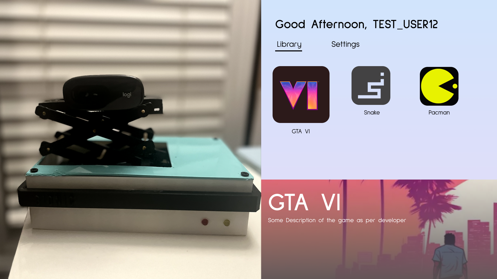

# Bionic Console

Next generation gaming console where you don't need a controller - you control the game with your hands!

Bionic features a sleek and 3D printed console, as well as a modern and intuitive user interface.

**Demo of Entire System**:

## **Features**

**Controls** - Bionic ditches traditional controllers or mouse & keyboard controls for games, and makess use of hand tracking to determine the action that the user is performing. The actions that are currently supported are
1. Index + Thumb and Middle + Thumb touch detection, used to simulate clicks
2. Left / Right detection (used to simulate movement, steering for example)
3. Front / Back detection (used to simulate movement, throttle for example)
4. Ring & Pinky Swing detection (when you swing the finger towards your palm, just two extra motions for more complex games)

Demo of Controls:

**Calibration System -** Different users have different hand sizes. Bionic introduces a new calibration system to account for all three dimensions to ensure proper detection
1. Automatic threshold detection - based on how big the user's hands are, a system automatically zooms the camera in and out to adjust for the x
2. Robotic arm system - used to move the camera up and down to adjust for y
3. Built in calibration sequence - forces the user to place hand in the middle fo the frame to adjust for z, before adjusting the x/y by methods mentioned above. 

Demo of Calibration:

**Game Library System** - UI specially designed to be a simple hub for all your games, taking the complexity out of steam or the playstation UI.

Demo of UI:
https://github.com/steven-mu12/Bionic/assets/62585035/5a8dd9e8-b021-49de-a902-95b199cdee6b

**Games** - Bionic pipes the controls above into various video games. For demo of this, please see the demo of system, where I play geometry dash with Bionic.

## **Technical Details**

**Controller**
- Built with python using tensorflow and opencv
- Custom trained on top of existing mediapipe model for better detection of the movement and more precise tap detection.

**Game Control**
- Done with pyautogui and autohotkey for control piping into different games

**Calibration**
- Built with OpenCV and the controller model for x/z axis
- Hardware arm system written in C++. Hardware built with OnShape and 3d-printing
- Actual product (casing) also built in OnShape, 3d printed

**Main UI**
- Built with python using PyQT5
- Designs are done with figma
