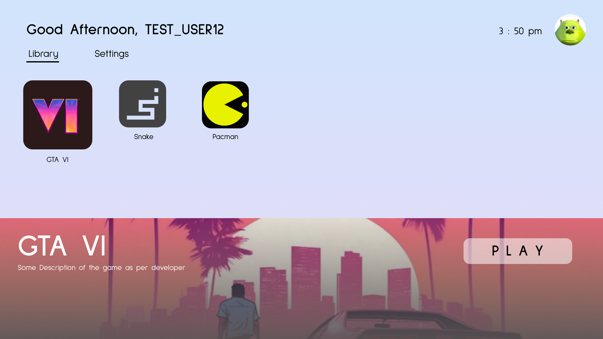

# Bionic

Next generation gaming console where you don't need a controller - you control the game with your hands!

## **Features**

**Controller System** - Basically, we use handtracking to generate an accurate controller ouput based on what motion is detected
1. Index + Thumb and Middle + Thumb touch detection
2. Ring & Pinky Swing detection (when you swing the finger towards your palm)
3. Left / Right Wave detection
4. Front / Back Push detection

**Calibration System -** When the user plays the game first of all, we need to calibrate the gloves based on lighting conditions. We also need to tell the user the distance they should be from the camera to play this.

- Calibration system needs to keep data for the size of user’s hands when a distance away from the camera system (see hardware below)
- threshold = 0.05 # WHEN BUILDING MAIN, TAKE USER's HAND INTO CONSIDERATION (ask the user to move further/closer and hold touch until good - use ultrasonic sensor for this)
- During Calibration, we want the user to place the hand in front of the system. We need a robotic arm to extend / Drop the arm to position the hand in frame of webcam (hardware)

**Game Library System** - Just a main page that the user can go and browse the game to play. You control this with the motion from the gloves.

**Actual Games Themselves**  - For later consideration. For now, we can do some sort of navigation game. But, it’s up to developers to create games based on the above controls.

**Hardware System**
- Lighting system - 2 light bulbs powered by an AC source (need to play with rectifiers)
- The system should act literally like a console, where the user is able to press a power button to power it up
- Heating management - make sure to calculate the thermal / heat flow of the system (wtf bro)
- During Calibration, we want the user to place the hand in front of the system. We need a robotic arm to extend / Drop the arm to position the hand in frame of webcam
- Design - Make it look good
